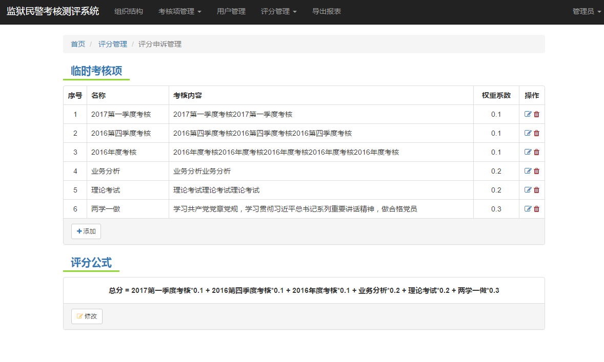
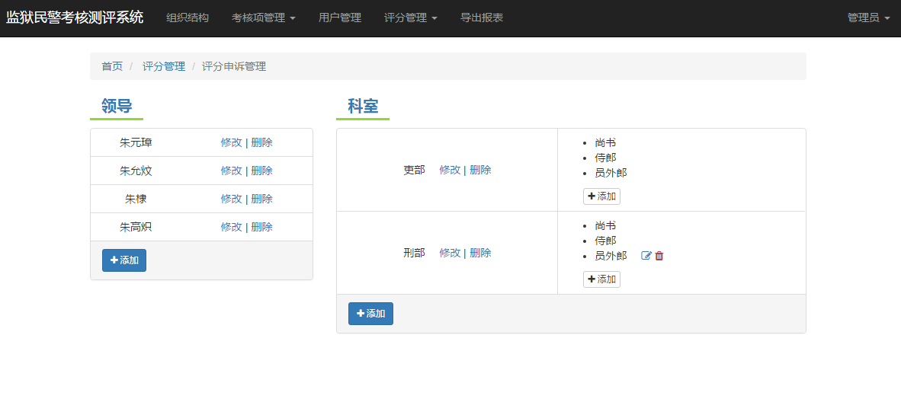

#### [demo](http://120.77.16.144:3000/#!/admin-index)

####  监狱民警考核测评系统
1. 后台：nodejs、express 
2. 前台：angularjs、bootstrap、jquery....
3. 工具：gulp、bower

####  目录
1. server 不是真后台，只是测试数据
2. views/src 编程文件
3. views/dest 目标生成文件

#### 效果图

### 系统展示步骤
1.  安装nodejs([官网下载](https://nodejs.org/en/download/),[备用下载](http://pan.baidu.com/s/1pK7X0jp))；
2.  到工程目录下；
3.  运行 npm install --production，下载后台所需的包；
4.  运行 npm install bower；
5.  运行 bower install，下载前台所需的包；
6.  运行 node app.js，启动服务。

### 地址列表
1.  登录页，http://127.0.0.1:3000/#!/login
2.  前台-评分列表，http://127.0.0.1:3000/#!/front-score
3.  前台-打分，http://127.0.0.1:3000/#!/front-score-user
4.  前台-我的评分，http://127.0.0.1:3000/#!/front-user
5.  前台-我的申诉，http://127.0.0.1:3000/#!/front-appeal
6.  后台-组织结构管理，http://127.0.0.1:3000/#!/admin-index
7.  后台-考核项管理-基础考核项，http://127.0.0.1:3000/#!/admin-basic-test-item-mamage
8.  后台-考核项管理-临时考核项，http://127.0.0.1:3000/#!/admin-temp-test-item-mamage
9.  后台-用户管理，http://127.0.0.1:3000/#!/admin-user
10.  后台-评分管理-临时项打分，http://127.0.0.1:3000/#!/admin-temp-score,  http://127.0.0.1:3000/#!/admin-temp-score-user
11.  后台-评分管理-评分申诉管理，http://127.0.0.1:3000/#!/admin-appeal-manage
12.  后台-导出列表，http://127.0.0.1:3000/#!/admin-export